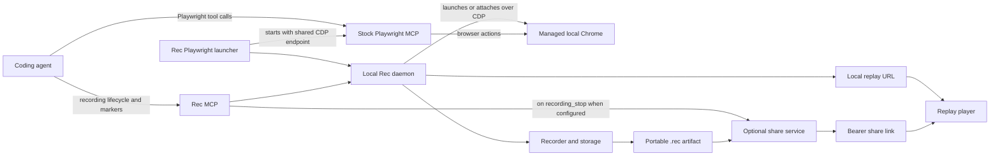
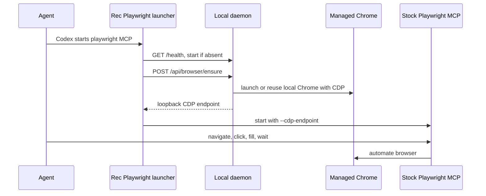
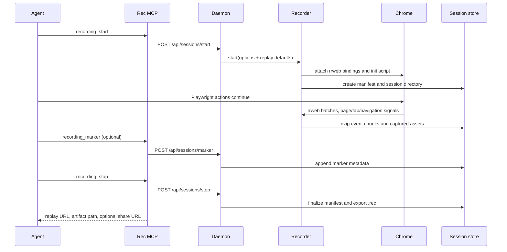
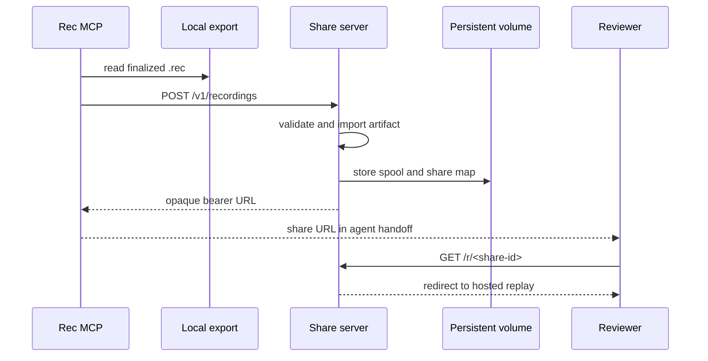
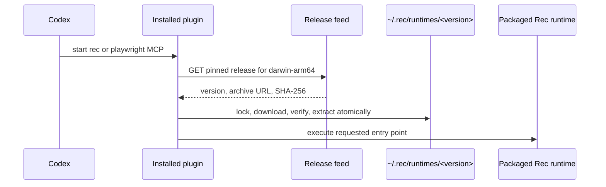

# Rec architecture

## Purpose

Rec captures a browser journey performed by a coding agent, stores it as a
portable DOM-based replay, and hands it back locally or through an optional
share link. It is designed around one important separation:

- **Playwright drives the browser.** It remains an independent MCP server.
- **Rec observes and records that same browser.** It does not proxy or
  reimplement Playwright tools.

That separation keeps the agent's normal browser workflow intact while giving
the resulting handoff a durable visual timeline, tabs, navigation transitions,
markers, and captured static assets.

## System overview



All capture state is local by default. The only hosted request in the normal
workflow is the optional upload performed after a recording has been finalized.

## Components and ownership

| Component | Location | Owns | Does not own |
| --- | --- | --- | --- |
| Core | `packages/core` | CDP recorder, rrweb event capture, session storage, assets, configuration, export/import | HTTP, MCP, player UI |
| Daemon | `packages/daemon` | One local recorder, Chrome lifecycle, local replay/data endpoints, automatic final export | Agent protocol and browser automation |
| Rec MCP | `packages/mcp` | Stdio MCP protocol, recording lifecycle tools, optional automatic upload handoff | Playwright tools or browser actions |
| Playwright launcher | `packages/playwright-launcher` | Starting stock Playwright MCP against Rec's managed Chrome | Recording or interpreting MCP traffic |
| Player | `packages/player` | Rendering a stored recording, timeline controls and reviewer-facing UI | Capture, persistence, sharing policy |
| CLI | `packages/cli` | Contributor/troubleshooting commands and manual artifact recovery | Normal coding-agent orchestration |
| Runtime | `packages/runtime` | Stable entry points and asset paths in a packaged distribution | Source builds or release delivery |
| Codex plugin | `plugins/rec-mcp` | Bootstrapping the packaged runtime and registering Rec plus the launcher | Rec implementation itself |
| Share server | `packages/share-server` | Validating uploaded artifacts, hosted replay, bearer-link lookup, runtime release feed | Live browser capture or authorization policy |

## Local agent capture

### Browser rendezvous

The browser is the shared boundary between Playwright and Rec. A coding agent
can use Playwright before it decides to record. The launcher starts the Rec
daemon on demand, asks it to ensure its dedicated Chrome, obtains the local CDP
endpoint, and starts stock `@playwright/mcp` with that endpoint.



Rec owns a Chrome it launches itself. It can alternatively attach to a supplied
**loopback-only** CDP endpoint through `recording_attach_browser`; in that case
the external browser is never stopped or reconfigured by Rec. Normal Codex use
relies on the managed-browser path, so users do not need to launch Chrome or
handle ports.

The local daemon binds only to `127.0.0.1` (default port `7717`). Its API is an
internal contract between the CLI, MCP server, launcher, and player; it is not
an internet-facing API.

### Recording lifecycle

`recording_start` is valid only after a navigated in-scope page exists. This
prevents empty recordings. The recorder connects to Chrome over CDP using
`playwright-core`, injects the rrweb recorder into eligible documents, and
observes all pages in the browser context.



Event batches flush every 500 ms into independently valid gzip chunks. A crash
can therefore lose at most the current in-memory batch rather than corrupting
the whole session. The recorder also copies eligible same-scope static assets
(stylesheets, images, and fonts) up to 10 MiB each and rewrites replay URLs to
the locally stored asset endpoint.

The recorder models a browser session, not a single DOM tree:

- Each page receives its own rrweb **segment**.
- Segment clock offsets place all tabs on one shared timeline.
- `opened`, `focused`, and `closed` tab events drive tab creation and selection
  during replay.
- Main-document transitions are stored as durable navigation intervals, with
  start, commit, ready, and URL metadata. The player uses that metadata rather
  than inferring a refresh from a reconstructed rrweb document.
- Markers are optional narrative metadata. Their `after_previous` or
  `before_next` placement is intentionally ordered, not a cross-server
  Playwright action ID. Agents must not issue a Playwright action and marker in
  parallel.

## Session and artifact data

The local Rec home defaults to `~/.rec` and is configurable through `REC_HOME`.

```text
~/.rec/
├── config.toml                 # optional user defaults
├── browser.json                # managed Chrome state
├── chromium-profile/           # managed Chrome profile
├── sessions/
│   └── rec_<id>/
│       ├── manifest.json
│       ├── markers.json
│       ├── events/<segment>-<sequence>.jsonl.gz
│       └── assets/<sha256>
├── exports/rec_<id>.rec        # finalized portable artifacts
└── runtimes/<version>/          # installed packaged runtime
```

`manifest.json` is the source of truth for a recording. It contains session
metadata, recording origins and masking policy, durations, segments, tabs,
navigation intervals, markers, asset metadata, and replay defaults. It is
updated atomically. Event files hold lines with the source segment, Rec receipt
time, and original rrweb event.

### Portable `.rec` format

Stopping a recording creates a `.rec` file automatically. It is a
gzip-compressed JSON envelope containing the complete manifest, every referenced
event chunk and captured asset, `markers.json` when present, and SHA-256
checksums for all included files.

Import validates the envelope before changing local state:

1. Decompress and validate the supported artifact version.
2. Verify the manifest checksum.
3. Derive the exact expected file set from the manifest.
4. Reject duplicate, missing, unexpected, or traversal-like paths.
5. Verify decoded sizes and SHA-256 checksums.
6. Write to a temporary directory and atomically install it under `sessions/`.

An existing session ID is never overwritten. These checks detect corruption and
malformed artifacts; they do not authenticate the sender or encrypt content.

## Replay architecture

The daemon serves the compiled player at `/replay` and exposes session endpoints
for a manifest, event streams, and captured assets. The share server serves the
same player and compatible endpoints, which keeps replay behavior independent of
where a finalized recording is opened.

The player turns a session timeline into reviewer-friendly playback:

- It selects the tab that was focused at the current recording time. Tabs are
  display state, not user-selectable playback controls.
- It reconstructs a smooth cursor path between relevant interaction targets;
  it does not blindly replay raw automation mouse events.
- It displays markers as the primary timeline annotations, and exposes
  hover tooltips for markers, idle ranges, and navigation ranges.
- It uses persistent navigation intervals to show refresh or navigation state
  accurately while playing and when seeking into or out of an interval.
- It supports **Cut**, **Fast-forward**, and **Keep** idle modes. Replay
  defaults are captured in the recording manifest so authors set a sensible
  initial experience while reviewers can still choose another mode.

Configuration is resolved per key in this order: built-in defaults, user
`~/.rec/config.toml`, project `.rec/config.toml`, `REC_CONFIG`, then matching
`REC_*` environment variables. Browser launch settings are fixed for a running
managed Chrome; a configuration change reports `restart_required` rather than
interrupting an active browser or recording.

## MCP contracts

The Rec MCP server is stdio JSON-RPC and exposes seven tools:

| Tool | Local daemon operation | Intended use |
| --- | --- | --- |
| `recording_browser_ensure` | Ensure managed Chrome and return CDP endpoint | Manual/standalone setup or diagnostics |
| `recording_attach_browser` | Attach to an explicit loopback CDP endpoint | External browser integration |
| `recording_start` | Start capture after page readiness | Begin evidence collection |
| `recording_marker` | Add narrative marker | Meaningful confirmed checkpoints only |
| `recording_status` | Read daemon, browser, and capture state | Diagnostics and readiness |
| `recording_stop` | Finalize, export, and optionally upload | Normal terminal handoff |
| `recording_share` | Upload a completed artifact | Retry/recovery for an earlier recording |

The normal agent sequence is:

1. Navigate with Playwright.
2. Start Rec when capture is requested.
3. Continue all browser actions through Playwright.
4. Add markers only where they make a reviewer understand the journey better.
5. Stop Rec and return the resulting replay/share URL.

The Playwright launcher is deliberately stdio-transparent after the browser
rendezvous. It does not inspect calls, issue synthetic markers, or try to
associate a Playwright action with a Rec marker by ID.

## Hosted sharing

The optional share server accepts only a completed portable artifact:



The service imports each artifact into a private spool, creates a random opaque
share ID, and persists the mapping in `shares.json`. It then serves the same
manifest/events/assets API as the local daemon. On Railway, `/data` must be a
persistent volume because the service stores both shares and release artifacts
there.

`recording_stop` attempts this upload automatically when `REC_SHARE_URL` is
configured. A failed upload does not discard the local result: the response
still contains the replay URL and portable artifact path, with `shareError` for
diagnostics. `recording_share` and `rec share` are recovery paths for an already
stopped recording.

Shares are currently unlisted bearer links. Anyone with the link can view the
recording. Authentication, authorization, expiry, revocation, retention,
auditing, encryption, and broader redaction are intentionally outside the
current architecture.

## Distribution and runtime bootstrap

Rec's user-facing Codex installation is a small plugin-only Git marketplace,
not a source checkout. The plugin registers two MCP entries: Rec MCP and the
Rec Playwright launcher. Both start through `rec-bootstrap.mjs`.



The bootstrapper uses an installation lock and verifies the downloaded archive's
SHA-256 before extraction. It currently supports macOS on Apple silicon
(`darwin-arm64`). A production plugin requests the exact runtime version it was
released with, so a new runtime is adopted only after an intentional marketplace
plugin upgrade.

`pnpm package:macos` builds a release archive containing the compiled runtime,
the player assets, production dependencies, and an embedded Node executable. It
removes source maps, declarations, and tests from the runtime payload. The
runtime's wrapper entry points set the daemon and player paths explicitly, so it
does not depend on a source checkout or the caller's working directory.

The release feed is hosted by the share server:

- Maintainers publish with an authorized `PUT /v1/releases` request.
- A version/platform pair is immutable once published.
- Production clients read `GET /v1/releases/<version>?platform=darwin-arm64`;
  `latest` remains available only for diagnostics and older plugins.

This packaging avoids making the source checkout a prerequisite for installation
but is not a cryptographic secrecy boundary: a packaged JavaScript runtime can
still be inspected. Future distribution hardening can add signing, notarization,
more platforms, authenticated downloads, and a hardened native launcher.

## Operational boundaries and current limitations

- The recorder captures DOM events and selected static assets, not scripts, API
  responses, or resources larger than 10 MiB.
- Password fields are masked. Broader input masking/redaction policy is deferred.
- Only loopback CDP endpoints are accepted for external attachment.
- The local daemon assumes one active recorder and one managed browser per Rec
  home/port. Deliberate isolation uses `REC_HOME` and `REC_PORT`.
- The share service is a single volume-backed instance, not a multi-writer or
  object-storage deployment.
- Runtime distribution currently targets only Apple-silicon macOS.
- The daemon and share service serve built player assets; a source checkout must
  build the player before running them in contributor mode.

## Development map

| Change needed | Start here | Related contract |
| --- | --- | --- |
| Capture behavior, masking, assets, tabs, navigation | `packages/core/src/recorder.ts` | `RecordingManifest` in `packages/core/src/types.ts` |
| On-disk sessions or `.rec` validation | `packages/core/src/storage.ts`, `packages/core/src/bundle.ts` | [recording format](docs/format.md) |
| Local endpoints or Chrome lifecycle | `packages/daemon/src/main.ts` | MCP/CLI calls and player API |
| Agent-facing tool behavior | `packages/mcp/src/main.ts` | [MCP guide](docs/mcp.md) |
| Shared Playwright browser startup | `packages/playwright-launcher/src/main.ts` | `@playwright/mcp` command and arguments |
| Playback/timeline UX | `packages/player/src/main.ts`, `packages/player/src/style.css` | persisted manifest metadata |
| Hosted links or release feed | `packages/share-server/src/main.ts` | portable artifact and Railway volume |
| Packaging or bootstrap | `scripts/package-macos.mjs`, `plugins/rec-mcp/scripts/rec-bootstrap.mjs` | release version and SHA-256 feed |

Run the focused package tests while changing a component, then run `pnpm check`
and `pnpm test` before a cross-component handoff. The repository's README and
the focused package READMEs describe user-facing operation; this document is the
maintainer's map of how those pieces fit together.
