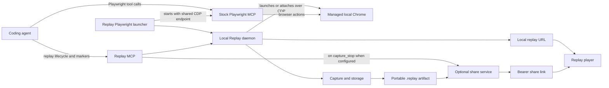
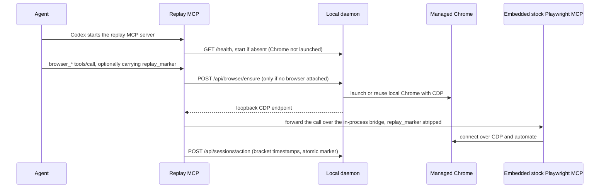
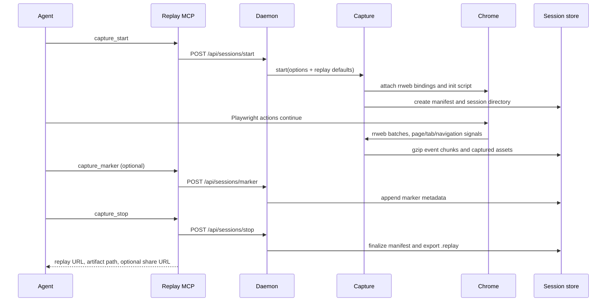
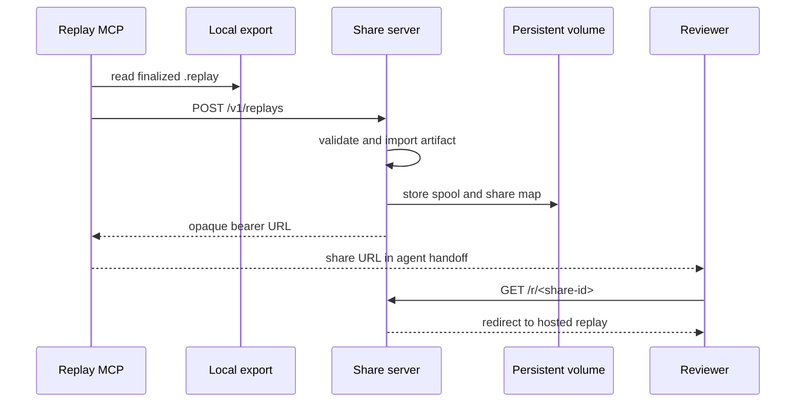
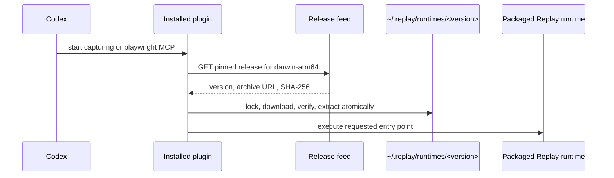

# Replay architecture

## Purpose

Replay captures a browser journey performed by a coding agent, stores it as a
portable DOM-based replay, and hands it back locally or through an optional
share link. It is designed around one important separation:

- **Playwright drives the browser.** It remains an independent MCP server.
- **Replay observes and captures that same browser.** It does not proxy or
  reimplement Playwright tools.

That separation keeps the agent's normal browser workflow intact while giving
the resulting handoff a durable visual timeline, tabs, navigation transitions,
markers, and captured static assets.

## System overview



All capture state is local by default. The only hosted request in the normal
workflow is the optional upload performed after a replay has been finalized.

## Components and ownership

| Component | Location | Owns | Does not own |
| --- | --- | --- | --- |
| Core | `packages/core` | CDP capture, rrweb event capture, session storage, assets, configuration, export/import | HTTP, MCP, player UI |
| Daemon | `packages/daemon` | One local capture, Chrome lifecycle, local replay/data endpoints, automatic final export, replay-assistant chat backend (Codex provider, tool bridge) | Agent protocol and browser automation |
| Replay MCP | `packages/mcp` | Stdio MCP protocol, replay lifecycle tools, the embedded stock Playwright tool surface (pinned `@playwright/mcp` behind an in-process bridge, `replay_marker` injection, action reporting), optional automatic upload handoff | Implementing browser tools itself |
| Playwright launcher | `packages/playwright-launcher` | Escape hatch: starting a separately installed stock Playwright MCP against Replay's managed Chrome when embedding is disabled | Replay or interpreting MCP traffic |
| Player | `packages/player` | Rendering a stored replay, timeline controls and reviewer-facing UI | Capture, persistence, sharing policy |
| CLI | `packages/cli` | Contributor/troubleshooting commands and manual artifact recovery | Normal coding-agent orchestration |
| Runtime | `packages/runtime` | Stable entry points and asset paths in a packaged distribution | Source builds or release delivery |
| Codex plugin | `plugins/replay-mcp` | Bootstrapping the packaged runtime and registering Replay plus the launcher | Replay implementation itself |
| Share server | `packages/share-server` | Validating uploaded artifacts, hosted replay, bearer-link lookup, runtime release feed | Live browser capture or authorization policy |

## Local agent capture

### Browser rendezvous

The browser is the shared boundary between Playwright and Replay. A coding agent
can browse before it decides to capture. Replay MCP embeds the pinned stock
`@playwright/mcp` in-process and forwards `browser_*` tool calls to it over an
in-memory bridge, injecting an optional `replay_marker` parameter into each tool
schema and stripping it before Playwright sees the call. Chrome is provisioned
lazily: before forwarding a browser tool call, Replay MCP asks the daemon for the
attached CDP endpoint and ensures Replay's managed Chrome only if none is
attached. Because embedded Playwright connects to that endpoint on its first
browser action, Chrome stays closed until the browser is actually used, not
merely because an MCP client started. Each forwarded call is reported to the
daemon with its request/response bracket; a call carrying `replay_marker` captures
that checkpoint atomically with the action, so marker-action association never
depends on call ordering. The separate launcher provides the same rendezvous
for an external Playwright MCP when embedding is disabled
(`REPLAY_EMBEDDED_PLAYWRIGHT=0`): it watches the forwarded stdio stream and asks
the daemon to ensure Replay's Chrome just before the first `tools/call` reaches
Playwright MCP.



Replay owns a Chrome it launches itself. It can alternatively attach to a supplied
**loopback-only** CDP endpoint through `capture_attach_browser`; in that case
the external browser is never stopped or reconfigured by Replay. Normal Codex use
relies on the managed-browser path, so users do not need to launch Chrome or
handle ports.

The local daemon binds only to `127.0.0.1` (default port `7717`). Its API is an
internal contract between the CLI, MCP server, launcher, and player; it is not
an internet-facing API.

### Local runtime lifecycle

The daemon is lazy-started by Replay MCP, the Playwright launcher, or a CLI command.
Those agent-facing processes acquire a renewable **agent lease** while they are
alive. When the last agent lease ends, the daemon waits 30 seconds by default,
then stops only Replay-managed Chrome. An open local player instead holds a
**replay lease**: it keeps replay data reachable but never keeps Chrome
running. Once no agent or replay lease remains, the daemon exits after 15
minutes by default. An active replay blocks automatic shutdown, and
`replay daemon stop` provides an explicit post-replay stop. Both grace periods
are configurable through `REPLAY_BROWSER_IDLE_TIMEOUT_MS` and
`REPLAY_DAEMON_IDLE_TIMEOUT_MS`.

### Replay lifecycle

`capture_start` is valid only after a navigated in-scope page exists. This
prevents empty replays. The capture connects to Chrome over CDP using
`playwright-core`, injects the rrweb capture into eligible documents, and
observes all pages in the browser context.



Event batches flush every 500 ms into independently valid gzip chunks. A crash
can therefore lose at most the current in-memory batch rather than corrupting
the whole session. The capture also copies eligible same-scope static assets
(stylesheets, images, and fonts) up to 10 MiB each and rewrites replay URLs to
the locally stored asset endpoint.

The capture models a browser session, not a single DOM tree:

- Each page receives its own rrweb **segment**.
- Segment clock offsets place all tabs on one shared timeline.
- `opened`, `focused`, and `closed` tab events drive tab creation and selection
  during replay.
- Main-document transitions are stored as durable navigation intervals, with
  start, commit, ready, and URL metadata. The player uses that metadata rather
  than inferring a refresh from a reconstructed rrweb document.
- Markers are optional narrative metadata. Their `after_previous` or
  `before_next` placement is intentionally ordered, not a cross-server
  Playwright action ID. Agents must not issue a Playwright action and marker in
  parallel.

## Session and artifact data

The local Replay home defaults to `~/.replay` and is configurable through `REPLAY_HOME`.

```text
~/.replay/
├── config.toml                 # optional user defaults
├── browser.json                # managed Chrome state
├── chromium-profile/           # managed Chrome profile
├── sessions/
│   └── replay_<id>/
│       ├── manifest.json
│       ├── markers.json
│       ├── events/<segment>-<sequence>.jsonl.gz
│       └── assets/<sha256>
├── exports/replay_<id>.replay        # finalized portable artifacts
└── runtimes/<version>/          # installed packaged runtime
```

`manifest.json` is the source of truth for a replay. It contains session
metadata, replay origins and masking policy, durations, segments, tabs,
navigation intervals, markers, asset metadata, and replay defaults. It is
updated atomically. Event files hold lines with the source segment, Replay receipt
time, and original rrweb event.

### Portable `.replay` format

Stopping a replay creates a `.replay` file automatically. It is a
gzip-compressed JSON envelope containing the complete manifest, every referenced
event chunk and captured asset, `markers.json` when present, and SHA-256
checksums for all included files.

Import validates the envelope before changing local state:

1. Decompress and validate the supported artifact version.
2. Verify the manifest checksum.
3. Derive the exact expected file set from the manifest.
4. Reject duplicate, missing, unexpected, or traversal-like paths.
5. Verify decoded sizes and SHA-256 checksums.
6. Write to a temporary directory and atomically install it under `sessions/`.

An existing session ID is never overwritten. These checks detect corruption and
malformed artifacts; they do not authenticate the sender or encrypt content.

## Replay architecture

The daemon serves the compiled player at `/replay` and exposes session endpoints
for a manifest, event streams, and captured assets. The share server serves the
same player and compatible endpoints, which keeps replay behavior independent of
where a finalized replay is opened.

The player turns a session timeline into reviewer-friendly playback:

- It selects the tab that was focused at the current replay time. Tabs are
  display state, not user-selectable playback controls.
- It reconstructs a smooth cursor path between relevant interaction targets;
  it does not blindly replay raw automation mouse events.
- It displays markers as the primary timeline annotations, and exposes
  hover tooltips for markers, idle ranges, and navigation ranges.
- It uses persistent navigation intervals to show refresh or navigation state
  accurately while playing and when seeking into or out of an interval.
- It supports **Cut**, **Fast-forward**, and **Keep** idle modes. Replay
  defaults are captured in the replay manifest so authors set a sensible
  initial experience while reviewers can still choose another mode.

Configuration is resolved per key in this order: built-in defaults, user
`~/.replay/config.toml`, project `.replay/config.toml`, `REPLAY_CONFIG`, then matching
`REPLAY_*` environment variables. Browser launch settings are fixed for a running
managed Chrome; a configuration change reports `restart_required` rather than
interrupting an active browser or replay.

### Replay assistant

The local player embeds an **Ask AI** chat panel; the daemon is its backend and
the OpenAI Codex CLI is the provider. The pieces and their boundaries:

- `packages/core` (`summary.ts`) distills the raw rrweb stream into a semantic
  timeline — navigations, labeled clicks, typed input, tab switches, markers,
  and idle gaps — that becomes the model's grounding context. All times are raw
  replay milliseconds.
- `packages/daemon` (`chat.ts`) owns chat sessions. Each user turn spawns
  `codex exec --json` (resuming the same Codex thread on later turns), parses
  its JSONL events, and streams the transcript to the player over SSE
  (`/api/chat/stream`). Availability is surfaced as `chat_available` in
  `/health`, mirroring `share_available` — the share server never reports it,
  so shared replays simply have no assistant.
- `packages/daemon` (`chat-bridge.ts`) is a minimal stdio MCP server that
  Codex spawns; it proxies every tool call back to the daemon. Read tools
  (`get_replay_overview`, `get_steps`) answer from the semantic timeline;
  player tools (`seek`, `set_playback`, `highlight`, `get_screen`) relay
  through the SSE stream to the player, which executes them against the live
  replayer and posts results back. Tool definitions carry MCP safety
  annotations and `execution.approval_mode = "never"`, because Codex otherwise
  auto-cancels MCP calls needing approval in headless exec runs.
- The Codex subprocess runs with a read-only sandbox, `--ignore-user-config`
  for reproducible behavior, and the replay's session directory as its
  working root. Everything stays on the local machine except the model calls
  made by the viewer's own Codex account.

## MCP contracts

The Replay MCP server is stdio JSON-RPC and exposes seven tools:

| Tool | Local daemon operation | Intended use |
| --- | --- | --- |
| `capture_browser_ensure` | Ensure managed Chrome and return CDP endpoint | Manual/standalone setup or diagnostics |
| `capture_attach_browser` | Attach to an explicit loopback CDP endpoint | External browser integration |
| `capture_start` | Start capture after page readiness | Begin evidence collection |
| `capture_marker` | Add narrative marker | Meaningful confirmed checkpoints only |
| `capture_status` | Read daemon, browser, and capture state | Diagnostics and readiness |
| `capture_stop` | Finalize, export, and optionally upload | Normal terminal handoff |
| `replay_share` | Upload a completed artifact | Retry/recovery for an earlier replay |
| `replay_overview` | Fetch a shared replay's summary from its link | Reading a replay handed off in a ticket or chat |
| `replay_steps` | Fetch a step slice of a shared replay | Zooming into a moment or marker remotely |
| `replay_fetch` | Download a shared replay into the local home | Deep local inspection of a remote replay |

The normal agent sequence is:

1. Navigate with Playwright.
2. Start capturing when capture is requested.
3. Continue all browser actions through Playwright.
4. Add markers only where they make a reviewer understand the journey better.
5. Stop capturing and return the resulting replay/share URL.

The Playwright launcher forwards stdio to stock Playwright MCP untouched, with
one exception: it detects the first `tools/call` in order to provision Replay's
Chrome just in time. It does not otherwise inspect calls, issue synthetic
markers, or try to associate a Playwright action with a Replay marker by ID.

## Hosted sharing

The optional share server accepts only a completed portable artifact:



The service imports each artifact into a private spool, creates a random opaque
share ID, and persists the mapping in `shares.json`. It then serves the same
manifest/events/assets API as the local daemon. On Railway, `/data` must be a
persistent volume because the service stores both shares and release artifacts
there.

`capture_stop` attempts this upload automatically when `REPLAY_SHARE_URL` is
configured. A failed upload does not discard the local result: the response
still contains the replay URL and portable artifact path, with `shareError` for
diagnostics. `replay_share` and `replay share` are recovery paths for an already
stopped replay.

Shares are currently unlisted bearer links. Anyone with the link can view the
replay. Authentication, authorization, expiry, revocation, retention,
auditing, encryption, and broader redaction are intentionally outside the
current architecture.

## Distribution and runtime bootstrap

Replay's user-facing Codex installation is a small plugin-only Git marketplace,
not a source checkout. The plugin registers two MCP entries: Replay MCP and the
Replay Playwright launcher. Both start through `replay-bootstrap.mjs`.



The bootstrapper uses an installation lock and verifies the downloaded archive's
SHA-256 before extraction. It currently supports macOS on Apple silicon
(`darwin-arm64`). A production plugin requests the exact runtime version it was
released with, so a new runtime is adopted only after an intentional marketplace
plugin upgrade.

`pnpm package:macos` builds a release archive containing the compiled runtime,
the player assets, production dependencies, and an embedded Node executable. It
removes source maps, declarations, and tests from the runtime payload. The
runtime's wrapper entry points set the daemon and player paths explicitly, so it
does not depend on a source checkout or the caller's working directory.

The release feed is hosted by the share server:

- Maintainers publish with an authorized `PUT /v1/releases` request.
- A version/platform pair is immutable once published.
- Production clients read `GET /v1/releases/<version>?platform=darwin-arm64`;
  `latest` remains available only for diagnostics and older plugins.

This packaging avoids making the source checkout a prerequisite for installation
but is not a cryptographic secrecy boundary: a packaged JavaScript runtime can
still be inspected. Future distribution hardening can add signing, notarization,
more platforms, authenticated downloads, and a hardened native launcher.

## Operational boundaries and current limitations

- The capture captures DOM events and selected static assets, not scripts, API
  responses, or resources larger than 10 MiB.
- Password fields are masked. Broader input masking/redaction policy is deferred.
- Only loopback CDP endpoints are accepted for external attachment.
- The local daemon assumes one active capture and one managed browser per Replay
  home/port. Deliberate isolation uses `REPLAY_HOME` and `REPLAY_PORT`.
- The share service is a single volume-backed instance, not a multi-writer or
  object-storage deployment.
- Runtime distribution currently targets only Apple-silicon macOS.
- The daemon and share service serve built player assets; a source checkout must
  build the player before running them in contributor mode.

## Development map

| Change needed | Start here | Related contract |
| --- | --- | --- |
| Capture behavior, masking, assets, tabs, navigation | `packages/core/src/capture.ts` | `ReplayManifest` in `packages/core/src/types.ts` |
| On-disk sessions or `.replay` validation | `packages/core/src/storage.ts`, `packages/core/src/bundle.ts` | [replay format](docs/format.md) |
| Local endpoints or Chrome lifecycle | `packages/daemon/src/main.ts` | MCP/CLI calls and player API |
| Agent-facing tool behavior | `packages/mcp/src/main.ts` | [MCP guide](docs/mcp.md) |
| Embedded Playwright bridge, `replay_marker`, action reporting | `packages/mcp/src/playwright-bridge.ts`, `packages/mcp/src/main.ts` | pinned `@playwright/mcp` dependency |
| External Playwright startup (escape hatch) | `packages/playwright-launcher/src/main.ts` | `@playwright/mcp` command and arguments |
| Playback/timeline UX | `packages/player/src/main.ts`, `packages/player/src/style.css` | persisted manifest metadata |
| Hosted links or release feed | `packages/share-server/src/main.ts` | portable artifact and Railway volume |
| Packaging or bootstrap | `scripts/package-macos.mjs`, `plugins/replay-mcp/scripts/replay-bootstrap.mjs` | release version and SHA-256 feed |

Run the focused package tests while changing a component, then run `pnpm check`
and `pnpm test` before a cross-component handoff. The repository's README and
the focused package READMEs describe user-facing operation; this document is the
maintainer's map of how those pieces fit together.
